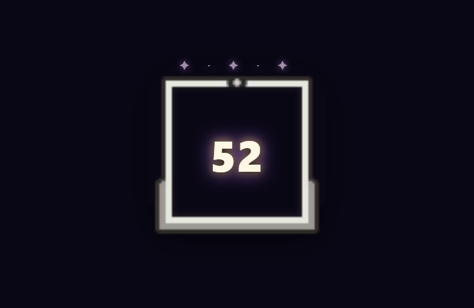

<p align="center">
  
</p>

<h1 align="center">Valorant Ranked Overlay</h1>
<p align="center"><strong>GalaxyBunny Studio</strong> · valorant-ranked-overlay</p>

<p align="center">
  Local overlay for <strong>OBS</strong> and <strong>Streamlabs</strong> — rank, RR, agent, squad, and level.<br>
  Same family as the Fortnite and Apex overlays: local dashboard + transparent browser sources.
</p>

<p align="center">
  <a href="https://hanacherry.github.io/valorant-ranked-overlay/?lang=en"></a>
  <a href="LICENSE"></a>
  <a href="package.json"></a>
</p>

<p align="center">
  <a href="README.md">Français</a> ·
  <a href="README.en.md">English</a> ·
  <a href="https://hanacherry.github.io/valorant-ranked-overlay/?lang=en">All languages on the site</a>
</p>

<p align="center">
  <a href="https://hanacherry.github.io/valorant-ranked-overlay/?lang=en">Presentation site</a>
</p>

<p align="center">
  
</p>

## A ranked studio for Valorant

This repository is a **streaming overlay studio** for Valorant: local dashboard, five transparent OBS overlays, galaxy themes, optional public Riot ID tracking, and optional Henrik API for squad stats.

## Preview

<p align="center">
  
</p>

<p align="center">
  
  &nbsp;
  
</p>

## Features

- **Rank & RR** — Iron 1 → Radiant, manual or from a public profile (Riot ID `Name#Tag`)
- **Five OBS / Streamlabs overlays** — ranked, compact, agent, squad, level — transparent background
- **Live session** — kills and session counters from the control panel
- **Agent & squad** — selected-agent overlay; ranks and stats for five teammates
- **Rank effects** — rank-adaptive glows (toggleable); respects reduced-motion settings
- **Private by design** — the server listens on `127.0.0.1` only
- **Optional Henrik** — API key only in `data/credentials.json` (Git-ignored)

## Quick start

Install [Node.js 18+](https://nodejs.org), then:

```sh
git clone https://github.com/HanaCherry/valorant-ranked-overlay.git
cd valorant-ranked-overlay
npm install
npm start
```

Open `http://127.0.0.1:8769/control.html`. Manual mode works immediately; add a Riot ID for optional tracking.

On Windows, `LANCER.bat` also starts the server. `LANCER-SILENCIEUX.vbs` starts it without a console after dependencies are installed.

## OBS / Streamlabs

1. Start the app and leave it running while you stream.
2. Copy the overlay URL from the panel.
3. Add a **Browser** source.
4. Paste the URL. The background is transparent by default.

| Source | URL | Suggested size |
| --- | --- | --- |
| Ranked overlay | `http://127.0.0.1:8769/overlay.html` | 700 × 220 |
| Compact | `http://127.0.0.1:8769/overlay-compact.html` | 420 × 140 |
| Agent | `http://127.0.0.1:8769/overlay-agent.html` | 760 × 210 |
| Squad | `http://127.0.0.1:8769/overlay-squad.html` | 440 × 260 |
| Level | `http://127.0.0.1:8769/overlay-level.html` | 250 × 260 |

## Profile tracking

Enter a public Riot ID, then **Connect my profile** / **Track this Riot ID**. The reader opens headless Edge or Chrome, reads the tracker, then closes. Typical interval: about 8 minutes. No API key for this mode. Public readers may be blocked (Cloudflare, private profile, rate limits).

**Private HenrikDev API** mode is optional for squad. The key stays in `data/credentials.json` and is never sent to OBS. Without a key, manual mode (rank, RR, session) still works.

## Local data

Your settings stay local:

- `data/` — config, session state, optional credentials

The `data/` folder is created automatically and **fully ignored by Git**. Do not force-add it.

```sh
npm test
```

## Identity / License

Logo: GalaxyBunny Studio. VALORANT and rank artwork belong to Riot Games and their respective owners. This is an independent project and is **not** an official Riot Games product.

**MIT** license.
