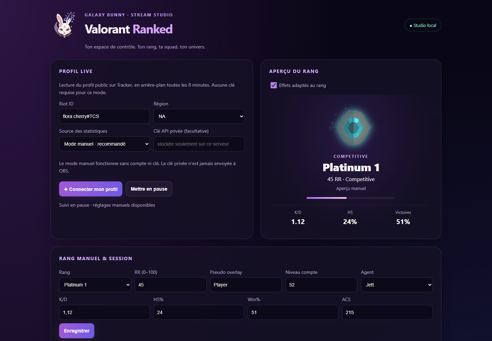
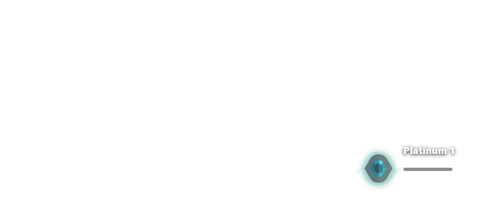

# Valorant Ranked Overlay

> Overlay Valorant local pour OBS et Streamlabs, conçu par **GalaxyBunny Studio**.

Même famille que les overlays Fortnite et Apex : tableau de bord local + **4 sources navigateur** transparentes.

## Les 4 overlays

| Source | URL | Taille conseillée |
| --- | --- | --- |
| Overlay classé (rang, RR, kills live) | `http://127.0.0.1:8769/overlay.html` | 700 × 220 |
| Compact (badge + rang) | `http://127.0.0.1:8769/overlay-compact.html` | 420 × 140 |
| Agent sélectionné | `http://127.0.0.1:8769/overlay-agent.html` | 760 × 210 |
| Squad (rangs & stats des 5 mates) | `http://127.0.0.1:8769/overlay-squad.html` | 440 × 260 |
| Badge de niveau (bordure officielle) | `http://127.0.0.1:8769/overlay-level.html` | 250 × 260 |

Les icônes de rang (Iron 1 → Radiant) et les bordures de niveau (1, 20, 40… 480) sont les assets officiels Valorant, stockés dans `public/ranks` et `public/levels`. Pour les rafraîchir : `node scripts/download-badges.js`.

## Démarrer

1. Installez [Node.js 18+](https://nodejs.org/).
2. Double-cliquez sur `LANCER.bat`.
3. Ouvrez `http://127.0.0.1:8769/control.html`.
4. Entre ton Riot ID (`Nom#Tag`) puis **Tracker ce Riot ID**, ou règle le rang à la main.
5. Pour les mates : 5 Riot ID dans **Squad** → **Charger la squad**.

## Aperçu

## Lecture navigateur · toutes les 8 minutes

Dans le panneau, saisis un Riot ID public puis clique sur **Connecter mon profil**. Le lecteur ouvre Edge ou Chrome sans fenêtre, lit Tracker puis ferme le navigateur. La prochaine lecture est programmée 8 minutes après la fin de la précédente. Le lanceur doit rester actif ; le panneau peut être fermé. **Mettre en pause** arrête les prochaines lectures.

Aucune clé API pour ce mode. Le navigateur utilise une session isolée et temporaire, sans profil personnel ni cookies importés. Les réglages restent dans `data/`. En cas de profil privé, vérification du site ou format non reconnu, le panneau affiche une erreur et les dernières données restent intactes. Les compteurs de session restent manuels : ce suivi ne lit pas les kills pendant la partie.

La lecture du profil réel doit être validée avec le Riot ID de l’utilisateur ; les tests automatisés couvrent des exemples de texte et la planification.

## Effets de rang

Le panneau Galaxy Bunny et les badges des overlays ranked, compact et squad adaptent leurs lueurs au rang. Désactive-les dans **Effets adaptés au rang**. Le réglage système de réduction des animations est respecté.

## Mode public et API privée facultative

Le mode manuel est le mode recommandé pour une publication publique : il ne demande aucune clé et permet de régler le rang, le RR et les compteurs de session depuis le panneau. Les lecteurs publics (ValoCheck, Tracker.gg, Valking et Blitz) sont proposés comme essais, mais peuvent être bloqués par Cloudflare, un profil privé ou une limite de service.

Le mode **API privée HenrikDev** est facultatif. Sa clé se stocke uniquement dans `data/credentials.json`, ignoré par Git, et n’est jamais envoyée à OBS ni intégrée aux pages d’overlay. Ne publie jamais ce fichier.

## API Henrik (squad)

Les stats publiques passent par [Henrik Dev API](https://docs.henrikdev.xyz/). Une clé API requise pour ce mode se stocke uniquement dans `data/credentials.json` (ignoré par Git). Sans clé, le mode manuel (rang, RR, session kills) fonctionne quand même.

## OBS / Streamlabs

Ajoute une source **Navigateur** par overlay, fond transparent. Garde `LANCER.bat` ouvert pendant le stream.

## Données

Réglages et état restent dans `data/`. Le dépôt n’embarque aucun Riot ID ni clé.

## Mentions

VALORANT est une marque de Riot Games. Projet indépendant, non affilié.

## Licence

MIT.
